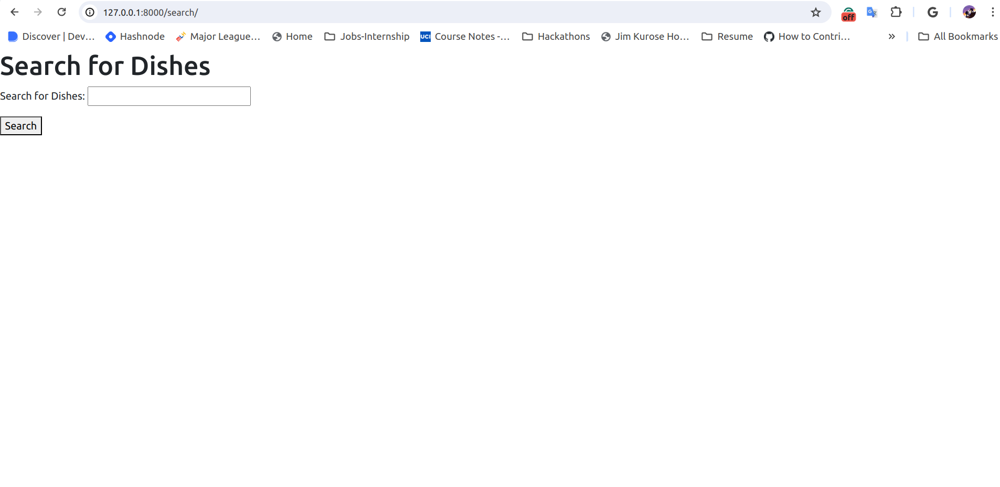

## Description

This is an admin-template based Django search application that can search through the names of dishes and recommend the best match.

## Installation

Follow these steps to install the project:

1. Clone the repository:
    ```
    git clone https://github.com/HimanshuGarg47/Django-search-application.git
    ```

2. Navigate to the project directory:
    ```
    cd Django-search-application
    ```

3. Create a local environment:
    ```
    python3 -m venv .venv
    ```

4. Activate the environment:
    ```
    source .venv/bin/activate
    ```

5. Install dependencies:
    ```
    pip install -r requirements.txt
    ```

6. Run migrations:
    ```
    python3 manage.py makemigrations
    ```

7. Apply migrations:
    ```
    python3 manage.py migrate
    ```

8. Run the server:
    ```
    python3 manage.py runserver
    ```

9. Open your web browser and navigate to either of the following URLs:
    - [http://127.0.0.1:8000/live/](http://127.0.0.1:8000/live/)
    - [http://127.0.0.1:8000/search/](http://127.0.0.1:8000/search/)
    - [http://127.0.0.1:8000/admin/](http://127.0.0.1:8000/admin/)

10. Type any dish in the search bar to perform a search.
### Example Image



---


---


---


---


---


---


---


---


---


---


---


---


---


